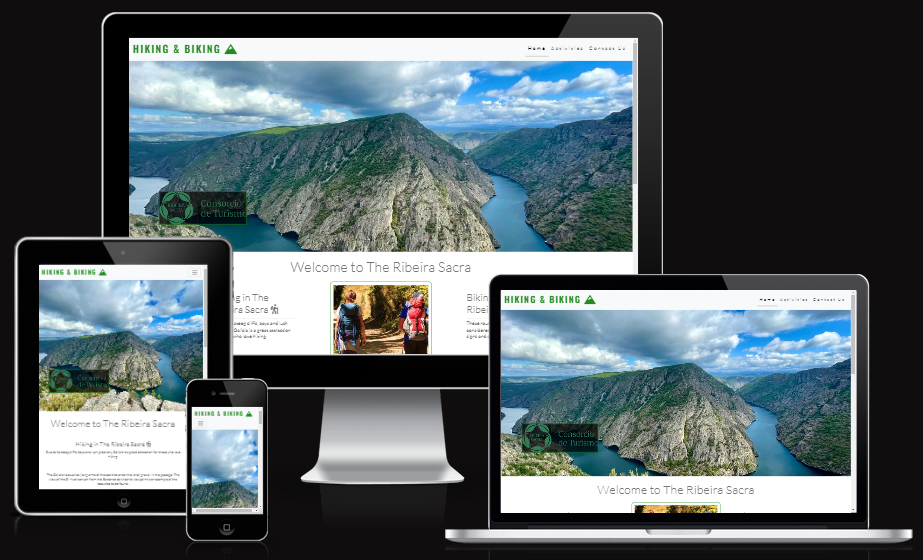

<h1>Hiking & Biking</h1>

Hiking & Biking is a website designed to be informative and is aimed primarily at tourists who are keen on exploring new and interesting hiking and biking trails. The site will consist of three pages and will focus on the Ribeira Sacra region in southern Lugo province in the autonomous region of Galicia in northwestern Spain. 

The Ribeira Sacra offers stunning landscapes, panoramic mountain ranges and large flowing rivers ideal for any type of outdoor enthusiast, but in this case focusing on hikers and cross country bikers. The site is designed to be responsive across all devices making it easy for people to access not just via desktops/laptops but also on tablets and mobile devices.

The site has the protenial to expand it's information base in the future to include other areas of Spain and Europe as a whole. As a business idea, the site can add to the Ribeira Sacra's growing tourist industry and reputation as an area of outstanding natural beauty and is currently shortlisted to be recognised as a UNESCO World Heritage Site.

[Link to the live site](https://kdugg84.github.io/CI-Hiking-And-Biking-MS1-GP/)

<h2>Table of Contents</h2>

* [User Experience](#UserExperience)
    * [User Stories](#UserStories)
    * [Strategic Trade Offs](#StrategicTradeOffs)

* [Design](#Design)    
    * [Colour Scheme](#ColourScheme)
    * [Typography](#Typography)
    * [Imagery](#Imagery)
    * [Wireframes](#Wireframes)
    * [Features](#Features)
    * [Future Implementations](#FutureImplementations)
    * [Accessibility](#Accessibility)

* [Technologies Used](#TechnologiesUsed)
    * [Languages Used](#LanguagesUsed)
    * [Software, Frameworks & Libraries Used](#Software,Frameworks&LibrariesUsed)

* [Testing](#Testing)
    * [Validation](#Validation)
    * [Bugs and Errors](#BugsandErrors)  
    * [Known Issues and Fixes](#KnownIssuesandFixes)
    * [Testing User Stories](TestingUserStories)
    * [Further Testing](#FurtherTesting)
    * [Manual Testing](#ManualTesting)
    * [Lighthouse](#Lighthouse)

* [Deployment & Local Development](#Deployment&LocalDevelopment)   
    * [Deploying to Github Pages](#DeployingtoGithubPages) 
    * [Local Development](#LocalDevelopment)
       * [How to Fork](#HowtoFork)
       * [How to Clone](#HowtoClone)

* [Credits](#Credits)
    * [Acknowledgements](#Acknowledgements)       

<h2>User Experience (UX)</h2> 

The best (intuitive) UX creates single-use learning.

<h3>User Stories</h3>

* First Time Visitor Goals:

    * I want to easily understand the main purpose of the site and to learn more about what the site has to offer.

    * I want to be able to easily navigate throughout the site to find content that I am interested in.

    * I want to look for user feedback to see if the site is reliable and trustworthy.

    * I want to be able to locate social media links to see their followings and to determine how trusted and known they are.

* Returning Visitor Goals:

    *  I want to find the best way of contacting the site operators with any questions I might have.

    *  I want to find out about new routes that may have been added to the site. 

    * I want to find links to other external organizations based in the Ribeira Sacra.

* Frequent Visitor Goals: 

    * I want to be able to sign up to a newsletter to stay informed of any major changes/updates made to the site.

<h3>Strategic Trade Offs</h3>

| Opportunity/Problem                   | Importance      | Viability/Feasibility |
|:-------------------------------------:|:---------------:|:---------------------:|
| Create an online presence             | 5               | 5                     |
| Create a structured informative layout| 5               | 5                     |
| Offer informative location details    | 4               | 5                     |
| Social media interaction              | 3               | 3                     |
| Email newsletter                     | 2               | 1                     |
| Total                                 |19                | Avg 19        

Viability/Feasibility formula; take the average viability x the number of items.

Reasons for choosing the above opportunities.

* Online presence

    * This is of course manadatory and more than feasible given what I have learnt on the course up-to-now.

* Structured layout

    * This is again an important/mandatory area and well within my skill set, the Information Architecture of the site 
      needs to be intuitive meaning that you can easily learn how to use the site from it's layout. 

* Location details
    
    * This can be achieved throught the use of text and images relating to the specific regions that are covered within the activities page.

* Social media interaction

    * Again this is well within my skill set and can be as simple as the use of icons nested within the site's footer.

* Email newsletter 

    * Whilst I have the skills to create a signup/contact form, a database of customer details would be required to handle this particular feature and that is something at the moment is not within my skills set given the allotted time frame. 

<h2>Design</h2>

<h3>Colour Scheme</h3>

Because the site is focused on outdoor activities it felt appropriate to use colours that would help create and enforce the sense of being in the outdoors.

The two main colours used throughout the site are forestgreen (#228b22) used for the logo and borders for the imagery and lightgreen (#90ee90) for the footer.

<h3>Typography</h3>

There are two fonts that were imported into the project used throughout the site, Oswald (font-weight: 600) was used to create the logo and Lato (font-weight: 300) was used as the body text. The backup font used in the font-family is Sans-Serif incase the imported fonts fail to load. 

Because the site would have a white background for the majority of each page it felt necessary to avoid using black for the text instead using a shade of gray (#77777) to create a subtle contrast between the text and the white background.

<h3>Imagery</h3>

Imagery is important. The large, background hero image is designed to be striking and catch the user's attention. It also imploys the use of animations designed to make the image "pop" just a bit more.

The hero image came from a Google images search on the Ribeira Sacra [Click the link to view](https://aviturga.es/wp-content/uploads/2022/09/mirador-de-vilouxe.jpeg)

The Ribeira Sacra logo image came from their official website [Click the link to view](https://turismo.ribeirasacra.org/mediaCache/img/ribeirasacra.png)

The two center images used in the home page came from a related Google images search on hiking and cross county biking in Galicia:

* [The two hikers](https://www.stuff.co.nz/travel/destinations/europe/105683889/galicia-spain-hiking-the-last-unspoilt-coast-of-europe)

* [The mountain biker](https://www.lavozdegalicia.es/noticia/ourense/manzaneda/2023/04/07/manzaneda-bike-park-estacion-funciona-nueve-pistas/0003_202304O7C4994.htm)

The photos of the two Twitter users commenting on the site came from Code Institute's Whiskey Drop walkthrough exercise [Click the link to view](https://github.com/Code-Institute-Solutions/BootstrappingYourNextBigIdea-BS4) 

The imagery used throughout the activities page came primarily from the Ribeira Sacra's own guide to hiking and long distance mountain biking.
[Visit the official website](https://turismo.ribeirasacra.org/)

The Hero image was re-used as the background for the contact-us page as its such a striking photo helping to reinforce the beauty of the Ribeira Sacra.

<h3>Wireframes</h3>

The wireframes were created using Balsamiq desktop for Windows 10

* [Home Page](assets/img/readme/wireframes/Home.png)

* [Activities Page](assets/img/readme/wireframes/Activities.png)

* [Contact Us Page](assets/img/readme/wireframes/Contact.png) 

<h3>Features</h3>

Hiking & Biking consists of three pages (Home, Activities and Contact Us).

* Features that are common across the site include:

    * The logo acts as a link back to the home page regardless of which page the user is currently viewing.

    * A responsive navigation bar across the top of all three pages that adapts to being viewed on different screen sizes, below 991px the navigation anchor/list elements change to a dropdown hamburger icon for a more mobile friendly experience, the same happens when viewed on tablets.

    * Home - navigates to the home page.

    * Activities - navigates to the activities page..

    * Contact Us - navigates to the contact form page.

    * The footer houses the site's social media links represented by Font Awesome icons, when clicked will open (in a separate tab) that social media's home page.

* Home Page: 

    * A hero image taken from the Mirador de Vilouxe, a striking image which helps to give the user a sense of how spectacular the landscape of the Ribeira Sacra is.

    * A brief overview of the Ribeira Sacra broken into two sections covering both hiking and mountain biking in the region.  

    * A comments section below the overview with quotes from two users expressing their thoughts on the site linked via their Twitter accounts.  

* Activities Page:

    * An introduction on how to use the hiking guide along with a disclaimer reminding users of the risks involved in both activities. 

    * Each route detailed is accompanied by directions on how to get to each route from a start point, statistics on each route along with an image taken from that particular area. 

    * Each hiking route description also makes reference to whether it is suitable to bike the route as well.

    * A separate section on long distance mountain biking trails which follows the same layout as the hiking section to maintain the look of the page. 

* Contact Us Page:

    * Contains a contact form which can be used to receive more information, the form includes radio buttons where users can rate their overall user experience along with a comments section where they can elaborate more. As part of form validation the name and email fields have been set to required, this prompts the user to enter details if they have been missed. The form can be submitted using the submit button which POSTS to https://formdump.codeinstitute.net and returns the values entered.

<h3>Future Implementations</h3>

* A database for storing user's information as the basis for a newsletter or info pack which can be sent out to subscribers informing them of changes or updates being made to the site. 

<h3>Accessibility</h3>

Whilst coding the site I have ensured that the site is accesible for all. This is achieve by using:

* Google Dev Tools to check contrast of items.
* Alt tags to describe the images on site.
* Semantic HTML
* Aria Labels to hightlight areas for users who require the use of screen readers. 

<h2>Technologies Used</h2>

<h3>Languages Used</h3>

* HTML5 and CSS3
* JavaScript - the Hamburger Dropdown menu from Bootstrap 5.3

<h3>Software, Frameworks & Libraries Used</h3>

* [Balsamiq](https://balsamiq.com/wireframes/) was used to create the wireframes for the website.
* [Bootstrap 5.3](https://getbootstrap.com/) was only used to create the navigation bar taking advantage of it's built in responsive classes. The boilerplate was modified slightly to include a few custom CSS styles such as letter spacing and a bottom-border to help remind users of what page they are viewing.
* [Font Awesome](https://fontawesome.com/icons) was used extensively throughout the project, the mountain icon was used to develop to logo, the hiker and biker icons were used in both the home and activities pages, the GPS and warning icons at the top of the activities page and the social media icons used in the footer.
* [Google Fonts](https://fonts.google.com/) was used to import the Oswald font for the logo and the Lato font for the body text.
* Google Dev Tools was used to identify and resolve problems related to responsiveness and appearance.
* [Github](https://github.com/) was used to store my project in a repository.
* [Git](https://git-scm.com/) was used for version control.
* [Google](https://google.com) was used to research HTML & CSS.
* [Gitpod](https://www.gitpod.io/) the vast majority of my time was spent inside GitPod's VSCode Cloud IDE.
* CDNs [Cloudflare](https://www.cloudflare.com/en-gb/learning/what-is-cloudflare/) and [JsDelivr](https://www.jsdelivr.com/) were used for Font Awesome icons CSS minified and Bootstrap 5.3 minified.
* Free [Online Image Editor](https://www.online-image-editor.com/) was used to crop and resize some of the images used in the project.
* [Am I Responsive](https://ui.dev/amiresponsive) To create the responsive banner of devices.
* [Harvard Referencing Generator](https://www.mybib.com/tools/harvard-referencing-generator)

<h2>Testing</h2>

<h3>Validation</h3>

The W3C Markup Validation Service was used on all three pages as well as the CSS Validator.

* [Index HTML](assets/img/readme/validation/index-page-validation.png)
* [Activities HTML](assets/img/readme/validation/activities-page-validation.png)
* [Contact Us HTML](assets/img/readme/validation/contact-us-page-validation.png)
* [Stylesheet CSS](assets/img/readme/validation/style-sheet-validation.png)

<h3>Bugs and Errors</h3>

The online validator did throw up a few error warnings.

* The index page had one warning with regards to the hero image section having no header tag but a div is used to house the hero image container. [Refer back to Index HTML](assets/img/readme/validation/index-page-validation.png)

* The activities page had two errors with regards to unordered list elements nested inside two paragraph elements. An online search concluded that list items cannot be nested inside paragraph elements and this was corrected by separating the text into separate paragraphs with the list items separate inside their respective div elements. [Activities page errors](assets/img/readme/validation/activities-page-validation-errors.png)

* The stylesheet validator found one error with regards to incorrect values used for a padding style. This was corrected by changing padding to margin. [Stylesheet error](assets/img/readme/validation/stylessheet-validation-error.png)

<h3>Known Issues and Fixes</h3>

* One of the main issues during the development process was that when the site was viewed on smaller mobile devices a white margin would appear on the right hand side caused by the images being larger than the 320px viewport size which would result in a scroll effect. 

     * This was primarily confined to the home page where the centre images were causing the white margin effect. Because Bootstrap was not implemented across the entire website, the layout relied on the rule of thirds with regards to responsive design. 

     * The solution to this issue was a simple case of resizing the images container to a max width of 320px.

* Another issue occured with the centre image used at the top of the activities page which originally was applied with CSS as a background property but failed to load. The solution was to apply the image's url within an img element.

* A potential issue is the fact that the home page's main content under media queries isn't quite centered to the page when viewed on smaller device screens such as tablets and mobiles. The same is said for the infomation content at the top of the activites which was the result of replicating the media queries used on the home page along with repeating the layout to try to maintain a similar design theme throughout the site's three pages.  

<h3>Testing User Stories</h3>

* First Time Visitor Goals:

    * I want to easily understand the main purpose of the site and to learn more about what the site has to offer.

      * Upon entering the home page, users are greeted with a simple and easy to read navigation bar which allows them to travel to the page of their choice. (This ties in with point two "I want to be able to easily navigate throughout the site to find content that I am interested in.") The navigation bar links are also underlined depending on which page the user is viewing.

      * The user is greeted with a striking hero image which has added animations to make it stand out a bit more, this helps to reinforce the site's demographic as being tourists who are interested in the outdoors.

      * The home page's content is broken into two sections each with a header and description of what to expect from the Ribeira Sacra's hiking trails and cross country mountain biking routes.

      * The home page's content is complemented with images of two hikers and a cross country biker aimed at reinforcing who the site is targeted at.

      * The activities page has a simple layout with an introduction to using the guide and a desclaimer, the content consists of images and details of each trail/route. 

    * I want to look for user feedback to see if the site is reliable and trustworthy. 

      *  Below the home pages's main content are two users both with photos and Twitter accounts referencing the site's usefulness and how it helps them to plan their treks through the Ribeira Sacra.

    * I want to be able to locate social media links to see their followings and to determine how trusted and known they are.

      * The site's three pages contain social media icons located in the footer which when clicked will open in separate tabs allowing the user to view that particular social media page.

* Returning Visitor Goals: 

    * I want to find the best way of contacting the site operators with any questions I might have.
    
      * The contact-us page includes a form which users can fill out with their name and contact details in order to ask questions and make general inquiries or ask to receive more information pertaining to the trails and routes.

    *  I want to find out about new routes that may have been added to the site.

        * This particular goal would be more likely as a long term future as part of a business model to constatly update the site with new information relating to new hikes and routes not just within the Ribeira Sarca but to include other regions of Spain and even Europe as a whole?.

    * I want to find links to other external organizations based in the Ribeira Sacra. 

      * This could be done by linking an image of the organisation to the relevant url address. These would located in the footer of the each page along with the social media icons.

* Frequent Visitor Goals:     

    * I want to be able to sign up to a newsletter to stay informed of any major changes/updates made to the site.

      *  At the moment the site only has the contact form which a user can fill out their details to receive more information with regards to general queries. A database would be required to store users details to whic a new news letter could be sent out to various users who signed up to receive one.

<h3>Further Testing</h3>

* The website was tested using Chrome Dev Tools utilising the responsive features extensively to determine how the various pages responded to the media queries that were written for the various break points utilised by Chrome Dev Tools. 

* The website was viewed on various different devices such as Desktop, Laptop, Google Nexus 7 tablet and my Blackview BV6000 Android phone. 

* Friends and family members were asked to review the site to highlight any bugs or user experience issues.

<h3>Manual Testing</h3>

All throughout the development process as previously mentioned each page was consistently checked to make sure that they responded correctly to the various default breakpoints built into Chrome Developer Tools.

   * Each navigation bar link on each page was clicked to verify that it not only worked but took you to the correct page.

   * The social media icons were clicked in each page to verify that they opened in a new tab window and went to the correct social media home page. 

   * The Hiking & Biking logo was clicked in each page to make sure that it was correctlt linked to the home page.

<h3>Lighthouse</h3> 

Results: 

* [Index Page Lighthouse](assets/img/readme/lighthouse/index-lighthouse.png)
* [Activities Page Lighthouse](assets/img/readme/lighthouse/activities-lighthouse.png)
* [Contact Us Page Lighthouse](assets/img/readme/lighthouse/contact-us-lighthouse.png)

The diagnostics report for the activities page's performance highlighted these issues:
   * Serve static assets with an efficient cache policy (21 resources found)
   * Image elements do not have explicit width and height
   * Avoid enormous network payloads Total size was 7,747 KiB
   * Minimize main-thread work 2.4s
   * Avoid chaining critical requests (7 chains found)
   * Keep request counts low and transfer sizes small (31 requests • 7,747 KiB)
   * Largest Contentful Paint element (1 element found)
   * Avoid large layout shifts (5 elements found)
   * Avoid long main-thread tasks (5 long tasks found)

The diagnostic report for the contact us page's accessibility score was lower originally (88) which was attributed to the lack of aria-labels written into the form's inputs. [The report suggested this website](https://dequeuniversity.com/rules/axe/4.6/label) 

<h2>Deployment & Local Development</h2>

<h3>Deploying to Github Pages</h3>

* Choose the repository you want to deploy from the main overview.
* Go to settings by clicking on the icon on the menu.
* In the left navigation, select the "Pages" option.
* Under "Source", choose "Master" branch and click "Save".
* After it's done, you will see a message saying "Your site is ready to be published at (insert url here)".

<h3>Local Development</h3>

<h4>How to Fork</h4>

Forking is the process of creating a copy of the original repository. The process allows a developer to make any changes without affecting the main repo.

To do this: 

* Search for the Github repo you want to copy.
* Select the "Fork" button located in the top right corner which is located under your profile icon.
* Once completed, you will now have your own version of that repo to make changes to.

<h4>How to Clone</h4>

To copy a Github repository:

* First navigate to the repository you wish to copy.
* Click on the "Code" button (which has a download icon) and copy the link provided. 
* In the Gitpod terminal, navigate to the directory where you want to place the clone. Then, type "git clone" and paste the link you copied earlier and press enter.
* Another way to push a cloned repository to a new Gitpod workspace can be done through the use of a Gitpod extension installed in your prefered browser, in my case Google Chrome. This browser extension will add a green Gitpod button to your Github account and will be visible on every repository created, cloned or searched for.

<h2>Credits</h2>

Flexbox code:

* McGrath, M. (2020). HTML, CSS & JavaScript. Special Edition ed. United Kingdom: In Easy Steps, p.292/293.

<h3>Acknowledgements</h3>

* Chris Quinn (Mentor) - for offering guidence and support for the project from it's inception, development and deployment.

* Code Institute student cohort on Slack - always offering help and solutions. 

* Callum Jones - for offering helpful advice and tips.